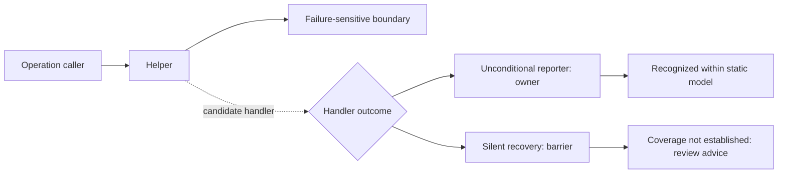

# Accuracy, reporting paths, and enterprise review exports

Historical increment: see [workflow analysis and review](WORKFLOW_ACCURACY.md) for the current callable/path behavior, expanded corpus, runtime collector, cache, queue, and validation. The five evaluation cases and metrics below describe the previous revision; those cases are now development regressions.

This increment implements all three P1 and all three P2 items. Analysis remains deterministic and framework-neutral. Scanning, diagram generation, SARIF export, and runtime-trace import never execute the target application.

## P1: Measured accuracy

```powershell
python scripts/benchmark_accuracy.py --check benchmarks/baseline.json --output .artifacts/accuracy.json
```

The pinned [manifest](../benchmarks/manifest.json) separates eight authored development cases from five independently authored PyCG evaluation cases. Development labels cover calls, all eight finding rules, and reporting owners, including negative controls. Evaluation uses PyCG's original call labels; it has **no independently labeled instrumentation or owner judgments**. Fixture bytes and upstream labels are SHA-256 checked before scanning. The benchmark does not execute fixtures or require their dependencies.

Each case reports true positives, false positives, false negatives, exact unexpected/missing labels, and precision/recall; findings also have per-rule breakdowns. Totals pool counts within each split. Zero denominators produce `null`, not perfect scores. Missing expected symbols stay in the recall denominator. Calls are unique caller/callee pairs, findings are `(rule, qualified symbol, line)`, and owners are unique `(boundary function, reporting function)` pairs; these are not call-site, path, or event-delivery metrics. Owners count only for recognized coverage decisions. Module symbols are normalized by removing `.<module>` to match PyCG labels. See [corpus provenance](../benchmarks/README.md).

| Split and metric | Correct | Extra | Missed | Precision | Recall |
| --- | ---: | ---: | ---: | ---: | ---: |
| Development calls | 4 | 0 | 0 | 100% | 100% |
| Development findings | 8 | 0 | 0 | 100% | 100% |
| Development owners | 1 | 0 | 0 | 100% | 100% |
| Evaluation calls | 3 | 0 | 6 | 100% | 33.3% |

The small evaluation set deliberately retains misses involving callable aliases, callable tuple assignments, and returned callables. These measurements do **not** estimate enterprise precision or recall. They expose known gaps and provide reproducible regression checks. CI fails if a case gains false positives or misses relative to the checked-in baseline; corpus membership and split changes require explicit baseline review. Do not regenerate labels or expected results merely to make a regression pass. Treat future cases used for tuning as development material, and add fresh held-out evaluation samples.

## P1: More conservative call resolution

The receiver index now supports inherited ordinary methods through a single known class chain, zero-argument unshadowed `super()`, consistent constructor parameter inputs from indexed call sites, and fixed-arity tuple-return unpacking. Constructor binding checks positional/keyword conflicts and rejects star-expanded or conflicting inputs. Conflicting tuple element types are rejected. Known method masks, dynamic attribute hooks, ambiguous definitions, and multiple-base lookup remain conservative. Inheritance traversal stops after 32 levels and all inference uses the existing type-work budget.

Annotations, absent external call sites, scope-wide assignments, and runtime mutation remain assumptions. This is not Python's complete method-resolution order or whole-program type inference. Callable-return inference, externally supplied constructor values, dynamic dispatch, and complex aliasing remain limited.

The four previous self-dogfood omissions are now required regression pairs:

- `MemberWrites.__init__ → ReturnValues.__init__`
- `ReceiverIndex.member → ReturnValues.visit`
- `ReturnValues.visit → ReceiverIndex.step`
- `evaluate → CoverageResult.extend`

## P1: Reporting-owner path view

Select a boundary in an HTML report and choose **Show reporting path**. The graph displays the caller relationships retained in that boundary's coverage explanation, marks **REPORTING OWNER** and **REPORTING BARRIER**, and keeps source-linked stop reasons in the inspector. **Clear reporting path** restores the ordinary neighborhood.



The view uses recorded call IDs rather than assuming that every edge between nearby symbols belongs to the reporting route. It may stop at the first uncovered route. The 64-item explanation cap and diagram node limit remain visible; this is an inspected-route view, not an exhaustive proof or runtime timeline. Green signal presence alone still does not establish coverage.

## P2: SARIF 2.1.0

```powershell
flowsignal scan C:\path\to\repository --format sarif --output report.sarif
flowsignal scan C:\path\to\repository --baseline baseline.json --format sarif --output report.sarif --timeout-seconds 300 --memory-mb 1024
```

Results contain rule IDs, relative URI-encoded paths, exact source lines, structural fingerprints, related evidence, conditional recommendations, assumptions, and available call paths. AST byte columns are intentionally omitted rather than misreported as character columns. `--no-source` continues to omit source excerpts.

SARIF `level` maps **review priority**: high → error, medium → warning, low → note. Suggested INFO/WARNING/ERROR logging levels remain separate conditional advice in result properties and messages. Active dismissals become justified external suppressions; expired dismissals do not. Matched/new findings use SARIF baseline states. Resolved/unverified baseline entries, lifecycle history, diagnostics, incomplete status, and runtime comparisons remain in run metadata. An incomplete report has `executionSuccessful: false`; CLI exit-code behavior is unchanged.

The exporter was validated locally with format checking against the [OASIS SARIF 2.1.0 schema](https://docs.oasis-open.org/sarif/sarif/v2.1.0/cos02/schemas/sarif-schema-2.1.0.json). No code-scanning service upload was performed. Import/display behavior still depends on the receiving service.

## P2: Dismissal lifecycle

```powershell
flowsignal review dismiss baseline.json FINDING_FINGERPRINT --owner workflow-platform --reason "Gateway owns final failure reporting" --expires 2030-01-01
flowsignal review restore baseline.json FINDING_FINGERPRINT --owner workflow-platform
flowsignal scan C:\path\to\repository --baseline baseline.json --save-baseline refreshed.json --fail-on medium --fail-on-new
```

Expiry is `YYYY-MM-DD` at **00:00 UTC** on that date. New dismissals default to 30 days; explicitly supplied past dates are refused. Owner defaults to `unspecified` for command compatibility, so enterprise review should supply `--owner`. Legacy baseline entries without expiry retain their old behavior until renewed.

Expired dismissals become active and participate in `--fail-on-new` as well as ordinary thresholds. Structural evidence/advice changes create active new findings; a matching old dismissed rule/symbol also appears in `renewal_required`. File or symbol renames remain unmatched, and the tool cannot always identify which historical review a new finding replaces. Moving lines alone can preserve a structural match.

Dismiss, restore, and expiration events retain fingerprint, owner, reason, expiry, and UTC timestamp in `review_history`; history survives baseline refresh and removal of old findings. HTML shows the latest 100 events, while JSON/SARIF and the baseline preserve the ledger. Input histories are bounded to 100,000 events. Expiration is recorded during comparison; persist it with `--save-baseline`. No scheduler or notification is created. This is a local review ledger, not an authenticated or tamper-evident audit system.

## P2: Import runtime evidence

```powershell
flowsignal scan C:\path\to\repository --runtime-trace trace.json --format html --output report.html
```

The importer reads a bounded UTF-8 JSON file (20 MB, at most 10,000 file hashes and 100,000 pair records):

```json
{
  "schema_version": "flowsignal-runtime-1",
  "files": {"app.py": "SHA256_OF_EXACT_SOURCE_BYTES_AS_64_LOWERCASE_HEX_DIGITS"},
  "pairs": [{"caller": "app.py:run", "callee": "app.py:Client.fetch", "count": 3}]
}
```

Replace the illustrative hash with the actual digest. Use source-root-relative POSIX paths and FlowSignal symbol IDs; module IDs end in `:<module>`. Counts default to one and duplicate pairs aggregate. Collect traces in the application's existing test or observability environment, hash the same source snapshot, and convert qualified names to report symbol IDs. Lambdas, nested wrappers, and unindexed generated functions can require explicit name mapping.

Pairs are classified as `observed_and_inferred`, `observed_only`, `unmatched_symbol`, or `source_mismatch`. Static pairs absent from matching observations are listed as `static_not_observed`; absence does not prove unreachability. HTML provides a **Show imported observations** overlay and pair details; mismatched/unindexed pairs remain in the comparison but do not become graph edges. Purple edges are imported observations, separately labeled from inferred calls. JSON, text, Mermaid, and SARIF retain comparison information or labeled edges.

Source hashes check snapshot agreement, not authenticity or trace completeness. Imported pairs **never remove findings, change static targets, or grant coverage credit**. No collector is automatically attached to an enterprise application. `scripts/validate_product_features.py` explicitly profiles only the small safe probe embedded in that script, then tests the scanner's import path.

## Validation and reproduction

```powershell
python -m unittest discover -s tests
python scripts/benchmark_accuracy.py --check benchmarks/baseline.json
python scripts/dogfood.py
python scripts/benchmark_scan.py --files 1000
python scripts/validate_product_features.py
node scripts/check_product_browser.cjs
```

The browser check needs an optional development installation of Playwright and Chromium. Product runtime dependencies remain empty.

Local Windows checks on Python 3.11.4 and 3.14.5: **194 tests passed, one symlink-capability test skipped** per interpreter. All 26 required self-dogfood relationships were observed and represented statically; the sampled HTML CLI execution had 216/216 observed pairs between indexed symbols represented. This is one execution sample, not general recall. The eight development and five evaluation benchmark cases passed their regression gate on both versions.

The 1,000-file generated workload produced exactly 500 uncovered and 500 covered boundaries, no unresolved calls or diagnostics, and took 4.198 seconds in one local run. It does not measure arbitrary enterprise workloads. The integration probe observed five inferred pairs and one additional callback pair, validated all five formats under worker supervision, dismissal/restore history, and expiry reactivation. A separate installed wheel passed the same integration probe. Existing review, typed-flow and supervision demonstrations also passed.

Browser checks and screenshot inspection covered 2560×1600, 1440×1000, and 390×844: exact reporting-route edges, owners/barriers, runtime overlay, keyboard controls, no document overflow or overlapping graph cards, and no report network requests or JavaScript errors. The CI Windows/Linux matrix includes the new accuracy gate and integration probe; remote CI has not run for these local changes.

Readiness remains **supervised pilot / advisory review**. The benchmark now makes several soft spots measurable; it does not eliminate them or establish acceptable accuracy for your workflow codebase.
