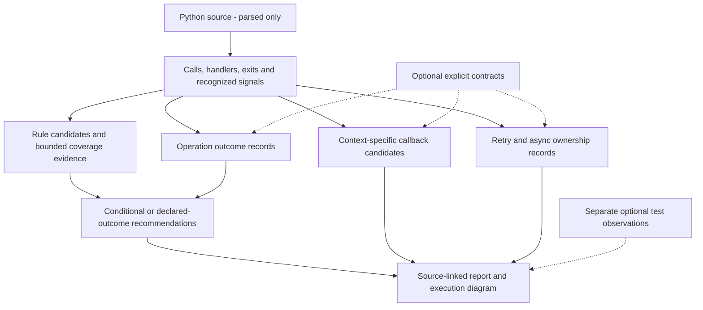

# Operation outcomes, ownership, and validation

This increment implements the analysis and tooling in FS-101 through FS-109 of the [objective backlog](IMPROVEMENT_BACKLOG.md). Independent recommendation adjudication remains pending. Performance results and unmet targets are recorded separately below. These features support general Python review without requiring a workflow framework or an LLM.



Context candidates and runtime observations do not automatically establish reporting coverage. Dashed inputs remain labeled declarations or selected observations.

## Declaring operation meaning

Static exits such as `return None`, `raise`, and `continue` do not establish whether a business operation succeeded. `operation_outcomes` retains those facts alongside a separate declared meaning, owner, source location, path, assumptions, and instrumentation decision. Undeclared, conflicting, or truncated outcomes stay unknown.

For a `flowsignal.toml` file:

```toml
[flowsignal]
entrypoints = ["orders.checkout"]
max_cache_bytes = 256000000
max_cache_entries = 16

[[flowsignal.operations]]
pattern = "orders.checkout"
scope = "handler"
exit = "return"
outcome = "degraded_recovery"
owner = "checkout-operation"

[[flowsignal.operations]]
pattern = "orders.checkout"
scope = "operation"
exit = "raise"
outcome = "failed_operation"
owner = "checkout-operation"

[[flowsignal.registrations]]
pattern = "dispatcher.register"
argument = 0

[[flowsignal.retries]]
pattern = "retry_api.run"
owner = "checkout-operation"
```

In `pyproject.toml`, use `[tool.flowsignal]` and `[[tool.flowsignal.operations]]` etc. Patterns match qualified names or file/symbol identities for operations; registration and retry patterns match resolved callable names. Configuration is validated before scanning. All three contract lists are bounded to 1,000 entries.

An operation contract requires `pattern`, `exit`, `outcome`, and `owner`. Optional fields are `scope` (`handler`, the default, or `operation`), `importance` (`routine`, `important`, `critical`), and `signal` (`auto`, `log`, `metric`, `trace`, `no_additional_log`). Exit values are `return`, `raise`, `fallthrough`, `break`, `continue`, and `unknown`. Overlapping contracts for the same scoped exit produce an incomplete-scan diagnostic; there is no first-match winner.

Contracts currently apply to every matching exit of that kind in the selected scope. They cannot distinguish two handler returns with different business meanings inside the same function. Do not make a broad declaration unless it applies to all those exits. Split the operation or leave the meaning unknown when it does not.

| Declared outcome | Default decision when reporting is not already recognized |
| --- | --- |
| `expected_rejection` | No additional log |
| `successful_recovery` | Metric |
| `degraded_recovery` | WARNING |
| `failed_operation` | ERROR at the declared owner |
| `cancellation` | No additional log; this is an explicit declaration |
| `successful_operation` | INFO only for important/critical events; otherwise no additional log |
| `unknown` | Retain conditional alternatives |

An explicit signal preference can select a metric, trace, or no additional log. Explicit logging for an otherwise routine event selects DEBUG. Existing handler reporting can produce a no-additional-log decision; insufficient severity for a declared failure produces an enrich-existing recommendation instead of a duplicate event. Operation-wide exit summaries do not prove that an existing signal covers every exit. Signal delivery, business ownership, and importance remain unverified declarations.

The decision table refines general outcome advice in FS001, FS003, and FS008. It does not suppress traceback/suppression checks or automatically grant boundary coverage. FS005 can still show conditional advice about a dependency failure distinct from an operation's declared recovered outcome. Review priority and confidence remain separate from log severity.

## Callable contexts and registrations

`contextual_calls` records possible targets for known callable arguments passed through ordinary helpers. Positional/keyword arguments, defaults, imports, simple bound methods, and chained forwarding are supported within the depth/work budget. Each record retains its originating call-site chain. Different callers binding different callbacks remain separate contexts.

These are candidate edges, not universal replacements for `Call.target`. They never establish exception-handler coverage by themselves. Rebinding, decorators, starred arguments, variadic helpers, conflicting names, unknown values, and unsupported binding forms remain conservative. The analysis stops at 2,000 candidate records and the configured graph/path limits, with an incomplete-scan diagnostic when context expansion is exhausted.

A registration contract identifies either a zero-based positional callback argument or a keyword argument name. It adds a **declared deferred registration** relationship, distinct from an ordinary call. Registration-time handlers are not credited with catching later callback failures. An unconfigured method named `register` does not gain a relationship by name alone. Conflicting contracts and unresolved callback expressions produce diagnostics.

## Retries and async ownership

`retry_scopes` separates retry-shaped attempt handlers from declared final operation owners. The supported structural subset is a constant `range(...)` loop with a handler that can `continue`, an explicit final return/raise after the loop or in its `else`, and no nested loop, unknown context manager, exception group, or break. This recognizes syntax, not whether every attempt executes or succeeds. Unknown shapes remain uncertain. Custom wrapper contracts retain declared ownership but do not prove retry mechanics.

FS010 flags ERROR-or-higher logging inside an attempt handler for review. Its advice distinguishes expected attempts from the final exhausted outcome; it does not automatically demote all retries. Supported branch reporting is considered collectively when checking reporting evidence. Degraded fallback uses the declared outcome table above.

`task_ownership` tracks direct `asyncio.create_task`/`ensure_future`, local aliases, direct awaits, saved `gather` aggregates, returned handles, and direct `TaskGroup` scopes. It records retained-unobserved, discarded, awaited, group-awaited, exceptions-collected, transferred, or uncertain states. FS009 reviews retained tasks without established failure observation; FS007 retains discarded-handle findings.

Awaiting `gather(..., return_exceptions=True)` collects exception values and does not establish that they were inspected. This remains true when the aggregate is assigned to a local variable before awaiting it. Complex container escapes do not become observed handles. TaskGroup exit establishes modeled aggregate observation, not delivery of a log. These distinctions follow [Python's asyncio task documentation](https://docs.python.org/3/library/asyncio-task.html).

Ownership is bounded to 32 paths and 512 statements per async function, plus the global graph budget. Implicit expression failures, arbitrary callback schedulers, dynamic task collections, complex control effects, and external owners remain uncertain. Await/TaskGroup status is syntactic observation evidence on modeled paths, not a guarantee that every child failure is processed at runtime.

## Reviewing the evidence

The HTML inspector shows operation outcomes, callback contexts, retry scopes, task ownership, and an expandable **Uncertainty and next actions** section for each finding. Declarations and ownership states use neutral styling; green remains associated with recognized instrumentation. The diagram distinguishes context candidates, deferred work, ordinary calls, and imported observations.

Uncertainty identifies the first function with a known gap along each displayed caller path. It does not claim statement order inside that function. Reasons distinguish unsupported semantics, unknown business outcomes, declarations, analysis budgets, and missing runtime observations. Actions point to a source site, a specific contract type, scope/budget adjustment, or optional selected runtime collection.

JSON adds `operation_outcomes`, `contextual_calls`, `retry_scopes`, `task_ownership`, and `recommendation_uncertainty`; the existing report schema remains backward compatible through additive fields. SARIF run properties and text retain these facts. Mermaid retains edge labels and recommendation comments; HTML is the richer evidence view. Source omission remains effective. Importing runtime observations never promotes context candidates to proven reporting coverage.

## Accuracy evidence and independent review

The unchanged 12-case PyCG evaluation contains 25 labeled call pairs. Definitive edges still identify **14 correct, zero extra, and 11 missed pairs** (56% recall). A separate metric including contextual callable candidates identifies **20 correct, zero extra, and five missed pairs** (80% recall). Contextual candidates have weaker semantics; these numbers must not be merged into a claim of complete call resolution. This small selected corpus does not measure enterprise-wide accuracy or instrumentation usefulness. Per-case misses and both metrics are retained in `benchmarks/baseline.json`.

FS-107 tooling now includes a source-only packet for **30 scopes across three pinned packages**: Flask services, Billiard background processing, and Tenacity callback/retry workflows. Full Python package sources, licenses, configurations, scope definitions, hashes, revisions, and the frozen rubric are retained in `benchmarks/workflow-cohort.json` and its corpus. These packages are parsed only; their code is not imported or executed during scoring.

```text
python scripts/workflow_review.py
python scripts/workflow_review.py --packet .artifacts/review.json
python scripts/workflow_review.py --reviews review-a.json review-b.json adjudication.json --output .artifacts/review-results.json
```

Reviewers label the scoped source before seeing scanner output. A completed case includes a rationale, complete expected findings, and outcome/signal/level/owner judgments with acceptable alternatives, including explicit no-additional-log cases. Empty lists explicitly label absence; pending/abstained cases stay null and unscored. The importer checks scope, source hashes, rubric, membership, label validity, and duplicates. Label order alone does not create disagreement.

Scoring publishes precision/recall by rule and workflow type, separate outcome/signal/level/owner agreement, combined choice agreement, denominators, Wilson intervals, and raw disagreements. Overall agreement includes every labeled judgment site, with missing advice counted as a miss. Matched-site agreement and its denominator are also reported separately, so absence of a recommendation is not confused with choosing the wrong signal. Every emitted alternative must be acceptable; suggesting every severity cannot receive perfect agreement. Reviewer identity is declared, not authenticated. The completion flag requires at least two independent reviewers, ten overlapping completed scopes, and all 30 scopes reviewed. Adjudication is tracked separately.

**No independent labels have been supplied. FS-107's human evaluation is pending.** Review tooling and synthetic importer tests are not independent validation. Reviewer selection is not required to implement or use FlowSignal. Tuning on this cohort in future requires moving the affected cases to development and selecting fresh evaluation cases.

## Cache behavior and scale

Caching stays opt-in. A changed scan reuses parsed facts but rebuilds global relationships; this is not dependency-directed incremental analysis. Keys include source bytes, configuration, Python minor version, source roots, and scanner implementation. Cached/fresh equivalence checks remove only cache and timing counters.

The cache now reuses the identity-checked bytes read during key construction instead of reading every source a second time. Bounded input reads allocate for the actual file size instead of the full configured maximum. Neither change establishes a globally atomic repository snapshot; scan a stable checkout.

Retention defaults to 256 MB and 16 current-format entries, across namespaces in the cache directory. Publication is atomic and oversized writes are skipped. Pruning only touches regular `flowsignal-<64 hex>.json` entries within the checked directory; unrelated files and links are not deleted. Legacy unprefixed cache files are not automatically removed. Concurrent publishers can temporarily exceed the cap; cache directories remain trusted local state, not a security boundary or authenticated report store.

`scan(..., measure=True)` adds discovery, cache lookup, source parsing/indexing, resolution, coverage/workflow, report/review, and publication timings. Default reports remain deterministic. `scripts/benchmark_workflows.py` measures fresh worker processes, peak working set/RSS, serialization and HTML rendering, settings, completion status, findings, and semantic equality over five repetitions. Windows and Linux peak-memory measurements use their respective OS APIs; they are not directly interchangeable.

```text
python scripts/benchmark_workflows.py --sizes 1000 --repeats 5 --output .artifacts/scale.json
python scripts/benchmark_workflows.py --sizes 10000 --skip-repositories --modes fresh --repeats 5 --output .artifacts/scale-large.json
```

The 10,000-file add-file scenario intentionally exceeds the default 10,000-file budget; its incomplete status must remain visible. Three selected public packages plus generated sources provide useful stress evidence, not a representative sample of private enterprise systems. Wall-clock targets are recorded observations, not fragile CI assertions.

### Windows measurements

Windows 10, Python 3.14.5; five fresh worker processes per mode. Median scan seconds are below. Peak memory includes export/render work; ranges, settings, counters, and per-phase samples are retained in the [raw results](../benchmarks/results/outcome-scale-windows.json). Timing variability includes ordinary activity on this development machine.

| Workload (Python files) | Fresh | Cold | Unchanged | Leaf edit | Shared edit | Config change | Add | Delete | Peak MiB, all modes |
| --- | ---: | ---: | ---: | ---: | ---: | ---: | ---: | ---: | ---: |
| flask (24) | 0.841 | 1.175 | 0.208 | 1.380 | 1.399 | 1.133 | 1.418 | 0.210 | 63.8 |
| billiard (28) | 1.380 | 2.059 | 0.243 | 2.290 | 2.230 | 2.048 | 2.347 | 0.247 | 94.0 |
| tenacity (12) | 0.326 | 0.433 | 0.068 | 0.537 | 0.540 | 0.449 | 0.523 | 0.069 | 38.3 |
| synthetic-1000 (1000) | 2.048 | 2.542 | 1.411 | 2.690 | 2.823 | 2.850 | 2.861 | 1.393 | 92.3 |

All these runs completed within their configured budgets and all measured cached modes matched fresh results. At 1,000 files, unchanged reuse is 68.9% of fresh median time, meeting the 70% target. Changed-source reuse misses the 110% target; cache decoding and publication still add overhead. The optimization removes duplicate reads; these measurements do not establish a general speedup for changed scans. Keep caching opt-in.

The separate Windows 10,000-file workload completed all five fresh scans: median **27.628 s**, range **24.766–35.882 s**, peak **516.2 MiB** including export/rendering. Median scan phases were discovery 0.926 s, source reading/parsing/indexing 16.256 s, resolution 4.114 s, coverage/workflows 5.314 s, and report/review 0.890 s. Serialization and rendering, measured outside scan time, took 3.100 s and 2.549 s respectively. Phase medians need not sum to the median total. It indexed 20,000 symbols and 19,998 calls, with 9,999 boundary review candidates. [Raw large-workload results](../benchmarks/results/outcome-scale-windows-10000.json) retain the settings and stage timings. This Windows run measured fresh scans only; cache mutation scenarios are measured separately on Linux. These direct API benchmark workers do not impose a memory cap.

The dense/cyclic shape uses an explicit graph budget of 2,000 to exercise incomplete results. The long-file shape contains 2,000 functions in one file. Run `python scripts/benchmark_workflows.py --sizes --skip-repositories --shapes --repeats 5 --output .artifacts/scale-shapes.json` to reproduce those separate stress workloads.

### Linux measurements

WSL2 Linux 6.18.33.2, Python 3.12.3, native Linux temporary source/cache directories; five repetitions per mode. These measurements share a workstation with the Windows runs but use a different interpreter and filesystem. They are not a controlled OS comparison. [Raw Linux results](../benchmarks/results/outcome-scale-linux.json) retain medians/ranges, phase timings, settings, status, and every comparison.

| Workload | Fresh | Cold | Unchanged | Leaf edit | Shared edit | Config change | Add | Delete | Peak MiB, all modes |
| --- | ---: | ---: | ---: | ---: | ---: | ---: | ---: | ---: | ---: |
| flask | 0.792 | 1.193 | 0.185 | 1.403 | 1.388 | 1.165 | 1.392 | 0.184 | 62.8 |
| billiard | 1.320 | 2.107 | 0.271 | 2.350 | 2.343 | 2.078 | 2.317 | 0.267 | 97.3 |
| tenacity | 0.326 | 0.538 | 0.154 | 0.577 | 0.590 | 0.535 | 0.593 | 0.143 | 36.0 |
| synthetic-1000 | 0.942 | 1.562 | 0.600 | 1.733 | 1.595 | 1.549 | 1.640 | 0.578 | 94.5 |
| synthetic-10000 | 12.606 | 18.031 | 5.494 | 19.509 | 19.334 | 17.377 | 16.321 | 5.535 | 667.9 |

Every measured cached mode matched its fresh comparator. All runs completed except the five 10,000-file add-file runs: they correctly reported `file_limit` after the input grew to 10,001 files. Unchanged reuse met the 70% target at 1,000 files on both Windows and Linux. Leaf-edit reuse missed the 110% target on every primary workload on both platforms. Deletion restores a previously cached source state in this benchmark; its fast result does not measure arbitrary deletion cost.

At 10,000 files, fresh Linux scan time ranged from 12.161 to 13.143 seconds, unchanged reuse from 5.414 to 5.846 seconds, and leaf-edit reuse from 18.432 to 19.998 seconds. The largest measured working set/RSS across primary workloads was 667.9 MiB including serialization/rendering. Production worker memory settings should reflect workload measurements; the benchmark itself uses direct API workers without a memory cap. No selective dependency invalidation is claimed.

### Dense and long-file stress checks

Windows/Python 3.14.5, five repetitions of all eight modes; every cached/fresh comparison passed. [Raw stress results](../benchmarks/results/outcome-scale-shapes.json) preserve the full measurements.

| Workload | Fresh median | Warm median | Leaf-edit median | Peak MiB, all modes | Completion |
| --- | ---: | ---: | ---: | ---: | --- |
| dense-cyclic | 0.235 s | 0.247 s | 0.258 s | 36.1 | All runs incomplete as expected at graph budget 2,000 |
| long-file | 3.775 s | 0.433 s | 4.568 s | 428.2 | All runs complete |

The cyclic fixture retains boundary findings and explicit `graph_work_limit` / `contextual_call_limit` diagnostics. An incomplete scan is never cached as a complete snapshot. The long-file case analyzes 2,000 functions in one source file.

## Validation

- 228 unit tests on Windows Python 3.11 and 3.14: 227 passed, one Windows symlink privilege skip. Linux Python 3.12: all 228 passed.
- Full CLI dogfood: 26 required relationships and all 250 observed pairs between indexed symbols matched on one exercised HTML command. Unexecuted alternatives remain unvalidated.
- Existing review, typed-flow, supervised-worker, product-feature, workflow, and 40-file cache-equivalence checks passed.
- New supervised outcome demonstration validates JSON, HTML, text, Mermaid, and SARIF without executing its deliberately side-effecting scanned source. SARIF passes its official JSON schema. An installed wheel produces equivalent report facts to the source checkout after removing root/cache/worker counters.
- Authored tests explicitly execute a three-file registration probe, deterministic async failure/collection/TaskGroup probes, and retry/log-capture probes. Public corpus code is never executed.
- Browser interaction, keyboard source navigation, geometry, partial/cyclic reports, long unresolved names, and remote-request/error checks passed at 2560×1600, 1440×1000, and 390×844; desktop/mobile screenshots were inspected.

Reproduce the new demonstration with `python scripts/validate_outcomes.py`; open `.artifacts/outcome-review/report.html`. The [backlog](IMPROVEMENT_BACKLOG.md) records what is implemented and what still needs external evidence.
