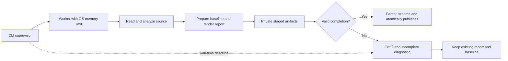

# Supervised scans and actionable uncertainty

Latest update: [accuracy and review](ACCURACY_AND_REVIEW.md) implements the six P1/P2 enhancements, including resolution of the four indexed dogfood omissions, SARIF, dismissal lifecycle, and runtime import. Implementation and validation statements below describe their earlier increment.

This increment adds the two recommended enterprise safeguards: bounded worker execution and explanations for unresolved calls. It is framework independent and never imports or executes scanned application code.

## CLI resource supervision

```text
flowsignal scan ./my-project --timeout-seconds 300 --memory-mb 1024 --format html --output report.html
```

Supplying either limit enables supervision and supplies the other default. Timeout accepts a finite number greater than zero up to 86,400 seconds. Memory accepts 32–1,048,576 MiB; very small limits may prevent the scanner from loading. These are CLI flags, not `Config` fields. Ordinary CLI scans and direct `scan()` calls continue using analysis-work budgets without an OS-limited worker.

The child starts with Python `-I` and an absolute bootstrap path from the current FlowSignal installation. It installs the memory limit before loading source, scanning, preparing baselines, or rendering. It stages all outputs privately. The parent waits with a wall-time deadline, kills and reaps a timed-out worker, and only publishes staged files after a valid completion result. No target application imports are performed.



Windows uses `JOB_OBJECT_LIMIT_PROCESS_MEMORY`, which limits committed memory allocations for the worker. Linux uses `RLIMIT_AS`, which limits address space and retains a tighter inherited limit if one exists. The two values have different OS meanings and are not RSS caps. See the [Microsoft Job Object documentation](https://learn.microsoft.com/en-us/windows/win32/api/winnt/ns-winnt-jobobject_extended_limit_information) and [Python resource documentation](https://docs.python.org/3/library/resource.html#resource.RLIMIT_AS).

If the OS backend is unsupported or cannot be installed, supervision fails closed. This version supports Windows and Linux; the Linux branch is covered by the CI matrix but was not executed on the local Windows host. Worker interpreter/bootstrap startup precedes installation of its memory limit. The supervisor deadline includes worker launch and completion, subject to OS process creation/termination responsiveness. The parent process, destination publication, filesystem capacity, and downstream stdout consumer are outside the worker limits. Publication uses 64 KiB chunks; report and baseline publication are separate atomic replacements, not a multi-file transaction.

This worker is not a security sandbox. It does not promise process-tree containment for future executable plugins, filesystem immutability, or network isolation. The scanner itself does not execute target code or launch target processes.

### Failure semantics

Timeout, cancellation, allocation failure, unavailable limits and unexpected worker termination return exit 2 and a bounded JSON record on stderr:

```json
{
  "schema_version": "flowsignal-worker-failure-1",
  "status": "incomplete",
  "diagnostics": [{"code": "worker_timeout", "message": "..."}],
  "worker_limits": {"timeout_seconds": 300, "memory_mb": 1024}
}
```

Codes are `worker_timeout`, `worker_cancelled`, `worker_memory_limit`, `worker_limit_unavailable`, and `worker_failed`. An unexplained OS termination is `worker_failed`; it is not attributed to memory without evidence. `worker_memory_limit` means an allocation failed while the memory cap was active. There is no invented empty/clean report after termination. Both existing destinations are preserved, including when the user requested `--save-baseline`.

Ordinary incomplete scans, such as a syntax error, can still finish the worker and publish their partial report with exit 2. They cannot save a baseline. Invalid options and configuration retain the usual CLI diagnostics. Successful JSON reports record the requested limits and backend in `analysis_stats.worker_limits`; a pre-existing OS limit may be tighter.

## Unresolved-call review

`resolution_gaps` contains one record per call whose resolution is explicitly `unresolved` or `ambiguous`. It does not turn imported dependency attribution into a claim that the dependency implementation was scanned.

Each record has `call_id`, `symbol`, `location`, `expression`, `reason`, `explanation`, `action`, `entrypoints`, and `context_truncated`. `summary.unresolved_reasons` groups the records. Reasons are evidence-based categories; when the precise cause cannot be established, the scanner retains an unknown category.

| Reason | Supported evidence |
| --- | --- |
| `ambiguous_definition` | Multiple definitions or import-root ambiguity prevented choosing one target |
| `inference_budget` | Type inference exhausted its configured work budget |
| `conflicting_receiver_types` | Conflicting receiver assignments in the supported scope model |
| `callback_parameter` | A function parameter is called directly |
| `inheritance_lookup` | Inherited-member or unshadowed `super()` lookup is needed |
| `decorated_helper` | A decorated helper produces an unresolved receiver |
| `unknown_member_type` | A receiver field has no established type |
| `shadowed_binding` | A local binding masks an imported/enclosing name |
| `dynamic_callable` | An expression or property result supplies the callable |
| `unknown_receiver` / `unknown_name` | The supported evidence does not establish a member target or unique named callable |

Local-class member calls whose implementations are unknown now remain unresolved, including nested field calls. They previously could be attributed as imports solely through the annotated receiver. This correction raises some unresolved counts without removing established internal edges.

Entrypoint context follows known reverse call edges, including possible deferred relationships. It is not a runtime reachability proof, a callback reconstruction, or an exhaustive list of external callers. Traversal stops at recognized entrypoints, uses `max_path_depth`, caps entrypoint lists at 64, and uses a dedicated `max_resolution_steps` budget (default 100,000, maximum 10,000,000). Enqueued edges and visited symbols consume this budget. Exhaustion adds `resolution_context_limit`, marks affected contexts partial, and makes the scan incomplete. Depth/list caps mark individual contexts partial. Cycles terminate through visited-state tracking.

HTML offers reason and entrypoint filters and keyboard-accessible navigation to source owners. The review list shows the first 100 matches; per-symbol inspectors and Mermaid comments retain up to 12 examples. JSON and text include all gap records. Empty entrypoint lists say only that no entrypoint was found through known routes. Source omission also applies to the new expression fields.

## Reproduce and validate

```text
python -m unittest discover -s tests
python scripts/validate_supervision.py
python scripts/dogfood.py --output .artifacts/supervised-dogfood
python scripts/benchmark_scan.py --files 1000
node scripts/check_supervised_browser.cjs
```

The demonstration scans `examples/uncertain_workflow.py` without executing it and writes `.artifacts/supervised-review/report.html`, JSON/text/Mermaid, baseline and validation files. It verifies four unresolved calls across three reasons, two possible entrypoints, and byte-for-byte preservation after a forced timeout. Browser checks require a separate Playwright/Chromium installation.

Local Windows validation on Python 3.11.4 and 3.14.5: **181 tests passed and one Windows symlink-capability test skipped** per interpreter. The 22 new tests cover real supervised success/threshold/baseline behavior, an actual allocation denied by the OS cap during rendering, timeout during rendering, worker crash, publication failure, target import isolation, reason classification, bounded caller context and report formats. Fault harnesses execute only test-authored code, never scanned applications.

The 1,000-file fixture still produced exactly 500 expected FS005 findings, with no unresolved calls or diagnostics; one run took 4.621 seconds. The self-dogfood harness retained all 22 required observed relationships and the four known indexed omissions. Counts can rise as the scanner gains code and stops attributing unknown local members to imports; use the generated validation JSON for the precise source snapshot, not historical counts from earlier increments.

The new HTML review passed reason/entrypoint filtering, source navigation, keyboard focus, node geometry and no page overflow/errors/remote requests at 2560×1600, 1440×1000 and 390×844. High-resolution and mobile screenshots were inspected. Existing typed-flow and baseline-review demonstrations also passed their browser checks. CI now runs the supervised demonstration in its Windows/Linux Python 3.11/3.14 matrix; remote CI for this uncommitted increment has not run.

Readiness remains a supervised enterprise pilot. Independent accuracy calibration, richer inheritance/callback analysis, SARIF and dismissal lifecycle remain separate work.

The wheel was also built and installed in a separate environment. Its supervised CLI generated all four report formats, classified the authored uncertainty cases, saved a baseline, and preserved both outputs after the forced timeout.
