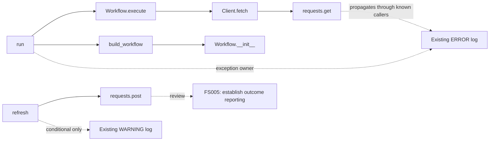

# Typed flow and coverage explanations

Latest update: [accuracy and review](ACCURACY_AND_REVIEW.md) implements the six P1/P2 enhancements, including resolution of the four indexed dogfood omissions, SARIF, dismissal lifecycle, and runtime import. Implementation and validation statements below describe their earlier increment.

The subsequent [supervision and uncertainty increment](SUPERVISION_AND_UNCERTAINTY.md) adds opt-in OS worker limits and unresolved-call review. Measurements here describe the earlier typed-flow revision.

FlowSignal now follows supported instance fields and local helper return values, then explains the reporting decision at each recognized boundary. The core remains general Python AST analysis: it does not require a workflow framework, execute the target, or use an LLM.

## What changed

Receiver inference handles typed parameters stored on `self`, direct constructors assigned to fields, matching literal tuple assignments to fields, local/imported helper returns, and ordinary method returns. Awaited async factories can supply a receiver; unawaited coroutine and generator creation cannot. Calls remain labeled `inferred_receiver`.

Conflicting concrete return or field types, unknown field writes, deletion, decorated helpers, shadowed names, and recursive helpers stay conservative. Return annotations may supply a type when the body is unknown; they are assumptions, not runtime contracts. Nullable annotations and returns describe a possible receiver, not proof that it is non-null. This is scope-wide inference, not statement-by-statement type analysis. Inheritance, external factory implementations, custom descriptors, monkey-patching and tuple-return unpacking remain limited.

The scanner's own `ReceiverIndex`/`ReceiverScope` interfaces also gained explicit annotations. Closing self-scan gaps reflects those interface clarifications together with the general inference improvements; no project-specific name rules were introduced.

Type inference is cached, guards recursive helper lookups, and has a configurable `max_type_steps` budget (default 1,000,000; maximum 10,000,000). Exhaustion is an incomplete scan, not a clean result. This is an analysis-work bound, not a worker memory or wall-clock limit.

## Coverage decisions

Every recognized failure-sensitive call gets a `coverage` record in JSON. Its `call_id` identifies the call; `status` is `recognized` or `not_established`. The **same decision** drives FS005. Dismissals and confidence filters affect finding review, not the underlying coverage record.

Evidence has a location, owning symbol, stable reason label, explanation, candidate-credit flag, and optional configured reporter owner. Credited evidence can occur in a decision that remains unestablished: for example, one caller reports but another does not. Green evidence means a recognized candidate signal, not a whole-program coverage guarantee.

Explanations include:

- Unconditional WARNING-or-higher logs and configured reporter contracts.
- Conditional signals, lower-level logs, typed-only handlers and silent consumption.
- Recognized span options, disabled/unknown options, and context-manager suppression barriers.
- Caller reporting owners, uncovered caller routes, entrypoint boundaries, cycles, depth and graph-work limits.
- Deferred work whose body does not execute within its creation-time handler/span.

Each explanation retains at most 64 evidence items and marks truncation explicitly. The verdict still uses the bounded analysis; truncating presentation does not establish coverage. An uncovered decision may stop at the first failing caller route. Positive decisions cover only resolved routes inspected by the model; unresolved/external callers and runtime delivery remain unknown.

HTML exposes the decision in the boundary inspector. Source buttons navigate to the owning function and preserve keyboard focus. Text includes all decisions. Mermaid exports the displayed neighborhood's verdicts and source evidence as comments. No new source literals are added to explanations when `--no-source` is used.

This work also fixes creation-time handler credit for explicitly configured async/generator boundaries: deferred bodies cannot borrow the creation site's exception reporting.

## Reproduce

With FlowSignal installed in your development environment:

```text
python -m unittest discover -s tests
python scripts/validate_typed_flow.py
python scripts/dogfood.py --output .artifacts/typed-flow-dogfood
python scripts/benchmark_scan.py --files 1000
node scripts/check_typed_flow_browser.cjs
```

The browser script requires Playwright and Chromium separately. The Python example requires no `requests` installation because it is scanned without execution. It writes HTML, JSON, text, Mermaid and validation results to `.artifacts/typed-flow/`.



## Recorded local validation

Windows, Python 3.11.4 and 3.14.5:

| Check | Result |
| --- | --- |
| Unit/regression suite | 159 passed, one Windows symlink-capability skip per interpreter; 25 new test methods, including positive and negative subcases |
| Real CLI self-dogfood | 22 required relationships corroborated in execution, static graph and HTML; five fault-injection scenarios and three authored runtime outcomes passed |
| Prior nine receiver/helper omissions | All nine now required regression relationships |
| Python 3.14 observed pairs between indexed symbols | 187 of 191 represented; four missing |
| Python 3.11 observed pairs between indexed symbols | 182 of 186 represented; the same four missing |
| Self-scan | 11 files, 150 symbols, 1,372 calls; 331 resolved internal call sites, 293 unresolved sites, 19 findings and 68 diagnostics |
| Authored typed-workflow CLI | Two required inferred method edges; one recognized and one unestablished boundary with source evidence |
| Synthetic 1,000-file workload | 8,000 symbols, 7,500 calls; exactly 500 FS005 findings; 500 recognized and 500 unestablished boundaries; no unresolved calls or diagnostics; 4.386 seconds in one local run |
| Interactive report | Coverage, source-owner navigation, keyboard focus, geometry, no page overflow/errors/remote requests at 2560×1600, 1440×1000 and 390×844; high-resolution and mobile screenshots inspected |
| Existing review/self-report browser checks | Passed at the same three viewports, including baseline review, reporter ownership and SVG export |
| Distribution | Wheel built, installed in a separate environment, and used to run the typed-workflow CLI validation successfully |

The new tests are authored regression cases, not independent precision/recall calibration. Runtime comparison samples one HTML CLI execution and excludes pairs involving unindexed expressions. The four remaining indexed omissions are `MemberWrites.__init__ → ReturnValues.__init__`, `ReceiverIndex.member → ReturnValues.visit`, `ReturnValues.visit → ReceiverIndex.step`, and `evaluate → CoverageResult.extend`. They involve inheritance/`super`, an unannotated constructor parameter, and tuple-return unpacking. The scanner continues to expose them rather than claim complete execution coverage.

The Windows/Linux Python CI matrix now includes the typed-workflow demonstration; remote CI for this uncommitted increment has not run. Independent enterprise calibration, hard worker isolation, SARIF and dismissal expiry/history remain follow-up work. Readiness remains a supervised pilot and advisory review tool.
