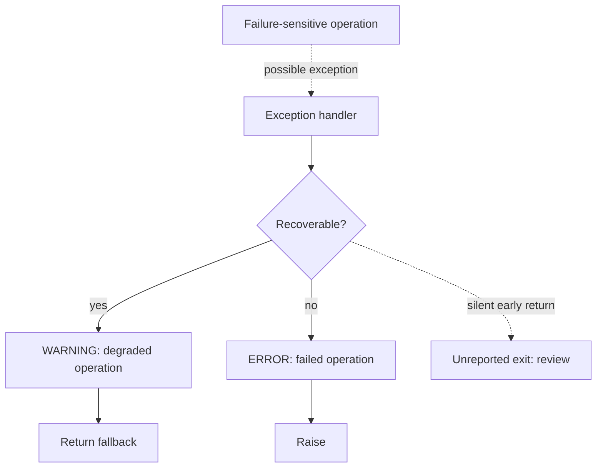
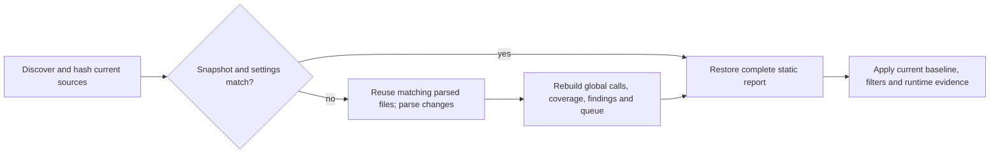

# Workflow analysis and review

This increment adds the next three P1 and three P2 capabilities: callable-value resolution, handler-exit reporting analysis, an expanded accuracy corpus and independent-label workflow, an explicit runtime collector, opt-in scan caching, and a workflow review queue. The core remains deterministic, dependency-free, and independent of workflow frameworks. Static scanning and importing runtime observations never execute the scanned code.

## P1: Callable values

Known imported function aliases, tuple-assigned callables, functions returned by indexed helpers, and returned bound methods can now produce internal call edges. Resolved callable values use `inferred_callable`; ordinary methods retain their receiver classification. Inference uses the existing type-work budget. Conflicting assignments, decorated functions, unknown callback parameters, ambiguous modules, and unsupported dynamic mutation do not gain speculative edges.

The six previously missed PyCG call pairs are now resolved. Those five fixtures have moved into the development split because they were used to guide implementation. They are regression evidence, no longer held-out evaluation evidence.

## P1: Handler reporting paths

Each exception handler exposes `reporting_paths`, `path_reporting`, and `paths_truncated`. Supported `if` branches, explicit returns/raises, loop exits, and `finally` effects are tracked separately. Reporting is credited only when every modeled exit contains a recognized immediate warning/error/critical log or configured reporter and no path is uncertain. Two branches can jointly establish reporting even though neither individual log is unconditional.



Selecting a handler in HTML shows each modeled exit, its branch conditions, reporting source lines, and uncertainty. Coverage explanations and SARIF metadata retain these paths. This is a bounded structured model, not an exhaustive statement graph: at most 32 states and 512 local work steps per handler, within the global graph budget. Loops retain zero-iteration and repeated-iteration uncertainty; context managers, pattern matching, and exception groups remain conservative. Short-circuit/deferred expressions do not establish unconditional reporting. Nested exception matching, implicit failures of every expression, reporter delivery, and business success are not proved. A truncated path set cannot establish coverage.

## P1: Accuracy and independent review

The pinned corpus now contains 13 development call cases, 12 fresh PyCG evaluation cases, and one three-file authored workflow awaiting independent instrumentation labels. All fixture bytes and upstream labels are hash checked. Evaluation source is parsed only. Results include per-rule finding metrics, per-feature call metrics, and explicit missing/unexpected labels.

| Split and metric | Correct | Extra | Missed |
| --- | ---: | ---: | ---: |
| Development call pairs | 13 | 0 | 0 |
| Development findings, eight rules | 8 | 0 | 0 |
| Development reporting-owner pairs | 1 | 0 | 0 |
| Fresh evaluation call pairs | 14 | 0 | 11 |
| Independent instrumentation judgments | Pending | Unscored | Unscored |

Fresh evaluation call precision is 100% and recall is 56% on this small, selected set. These are not enterprise accuracy estimates. The new misses are retained without tuning the implementation against those cases. [Corpus provenance](../benchmarks/README.md) lists the sources. Baseline checks reject membership, split, source, configuration, or label changes and per-case increases in false positives/misses; baseline revisions require explicit review.

```powershell
python scripts/benchmark_accuracy.py --check benchmarks/baseline.json --output .artifacts/accuracy.json
python scripts/benchmark_accuracy.py --export-review .artifacts/instrumentation-review.json
# After a reviewer completes the source-only packet:
python scripts/benchmark_accuracy.py --review-file .artifacts/instrumentation-review.json --output .artifacts/reviewed-accuracy.json
```

The [prepared packet](../benchmarks/instrumentation-review.json) includes source, rule definitions, hashes, and configuration, but no scanner judgments. A reviewer supplies identity, rationale, `completed: true`, finding triples `(rule ID, qualified symbol, line)`, and reporting-owner pairs `(boundary function, reporting function)`. Empty lists mean an explicit negative judgment; `null` means unlabeled. Import rejects incomplete or stale packets. Reviewer identity is declared, not authenticated. No independent instrumentation review has yet been performed; implementing the review workflow does not establish its accuracy.

## P2: Explicit runtime collection

Collection runs only when the caller deliberately enters the context around selected tests. It does not discover, import, or launch a target test suite.

```python
from flowsignal.collector import collect

with collect(
    "./application",
    "./reports/current-trace.json",
    run_id="checkout-tests-2026-09-22",
    scenario="success and timeout recovery",
):
    run_selected_tests()  # Your explicitly selected test runner/function.
```

```powershell
flowsignal scan ./application --runtime-trace ./reports/current-trace.json `
  --previous-runtime-trace ./reports/previous-trace.json `
  --format html --output ./reports/comparison.html
```

The collector records Python call pairs, source hashes, run identity, and collection status. It compares executing code objects against compiled source snapshots without executing those compiled snapshots, then rechecks source bytes at exit. Stale/changed source observations are excluded or marked incomplete. Existing profilers are refused; hooks are removed on exit. A trace-publication failure does not mask an exception from the selected tests. Each collector instance is single-use.

Default limits are 100,000 pairs and 1,000,000 profile events; file snapshots are bounded to 2 MB and 10,000 files. JSON import is bounded to 20 MB. Collection covers the current thread and threads created during the context. Join those threads before exiting. Existing threads, subprocesses, native call internals, and external-library endpoints are not included. Async resumptions may generate extra events, so counts are not guaranteed function-invocation counts. `run.complete` describes collector limitations, not whether tests passed or every application path ran.

Repeated-run comparison reports added, retained, and not-seen-again pairs only when both observations match the current source snapshot. It does not establish that an absent path was removed or unreachable. Runtime evidence never silently overrides static findings or reporting coverage. Externally supplied traces are not authenticated.

## P2: Opt-in incremental reuse

```powershell
flowsignal scan ./application --cache-dir ./.flowsignal-cache --format html --output report.html
python scripts/benchmark_incremental.py --files 1000 --output .artifacts/incremental.json
```

The API equivalent is `scan(root, config, cache_dir=Path(".flowsignal-cache"))`. Keys include source hashes, source-root configuration, complete scan settings, Python minor version, and scanner implementation bytes. An unchanged source inventory reuses the complete static report. Changed scans reuse unchanged parsed files and rebuild all global relationships, findings, and queue context. New/deleted files participate in invalidation. Runtime traces and baseline review decisions are applied afresh after static-cache reuse.



Cache files contain JSON with checksums, not pickle or executable bytecode. The cache directory must be trusted application state: checksums detect accidental corruption, not malicious cache forgery. Source text/AST literals and report evidence can be present. Linked cache paths are refused, reads/writes are bounded to 64 MB per record, incomplete scans are not published, and invalid records fall back to fresh analysis. Old report snapshots are not automatically evicted; operators should remove their dedicated cache directory when no longer needed. `.flowsignal-cache` is excluded from ordinary scans.

A local single-run 1,000-file measurement produced fresh **4.971 s**, cold-cache **7.180 s**, unchanged warm-cache **2.660 s**, and one-file-changed **8.512 s**. The changed scan reused 999 parsed files, and its complete semantic output matched fresh analysis. Cold and changed scans were slower because serialization and global rebuilding cost more than parsing these small files. Caching is opt-in; this implementation does not promise faster changed-source scans or rebuild only affected dependencies.

## P2: Workflow review queue

HTML has a paginated queue of findings and unresolved calls. Filter by active, new, expired, uncovered, unresolved, or dismissed state; narrow to an affected entrypoint; group by workflow or established reporting owner. Open a reporting path or source node directly. Review owners (human declarations) and reporting owners (static evidence) remain distinct. The same queue context is available in JSON and SARIF metadata.

Entrypoint context follows known reverse call edges within resolution/path budgets, with at most 64 entrypoints per item. Empty or truncated context does not establish unreachability. The queue respects finding confidence filters and baseline lifecycle decisions; it is not a complete inventory of every possible workflow state.

## Validation

On Windows, Python 3.11 and 3.14 each ran 212 unit tests: 211 passed and one platform-specific symlink test was skipped. The accuracy baseline passed. Self-dogfood corroborated all 26 required core relationships and all 231 observed pairs between indexed symbols in one HTML CLI execution. This is behavioral evidence, not whole-program accuracy.

`scripts/validate_workflow_enhancements.py` checks fresh/cached equivalence, collector/import comparison, baseline expiry/new states, branch reporting, and five export formats through a supervised worker. `scripts/check_workflow_browser.cjs` verifies queue filters, grouping, keyboard navigation, handler details, runtime comparison, layout, and absence of remote requests at 2560x1600, 1440x1000, and 390x844. CI includes the Python integration script and a 40-file incremental-equivalence workload on its existing Windows/Linux, Python 3.11/3.14 matrix.

Local validation also passed the installed-wheel integration run, existing review/typed-flow/supervision/product-feature scenarios, SARIF schema checks, lint, and formatting. Linux execution remains covered by the configured CI matrix, not claimed as locally verified here.

Readiness remains a **supervised enterprise pilot and advisory review tool**. Fresh evaluation misses and pending independent instrumentation judgments remain visible.
